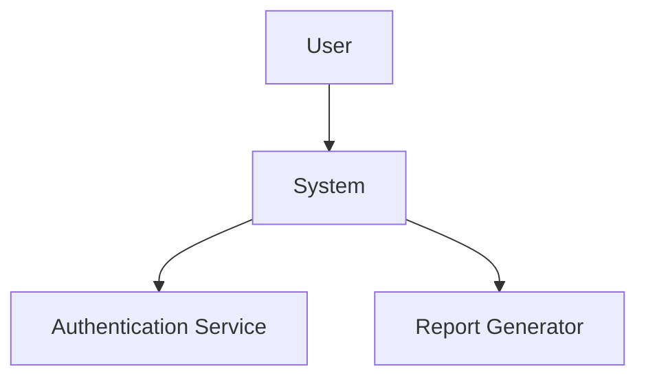

# Conversation Context Storage & Retrieval

## Overview

System tự động lưu trữ conversation context vào **PostgreSQL conversation table** với embeddings (Google Gemini `text-embedding-004`) để có thể retrieve sau này bằng semantic search.

## Architecture

```
ChatAgent Pipeline Results
        ↓
Auto-generate Summary
        ↓
Generate Embedding (Gemini text-embedding-004)
        ↓
Save to DB: conversation.summary + conversation.summary_embedding
        ↓
(Optional: Also store in MCP Vector for backup)
        ↓
Later: User searches
        ↓
Generate Query Embedding
        ↓
Cosine Similarity Search in PostgreSQL
        ↓
Return Top-K Similar Conversations
```

## Database Schema

**Table: `conversation`**
```sql
CREATE TABLE conversation (
    id SERIAL PRIMARY KEY,
    name VARCHAR NOT NULL,
    user_id INTEGER REFERENCES user(id),
    created_at TIMESTAMP DEFAULT NOW(),
    last_updated TIMESTAMP,
    status INTEGER DEFAULT 1,
    is_shared BOOLEAN DEFAULT FALSE,
    session VARCHAR,
    summary TEXT,                    -- Full context with requirements, analysis, diagram
    summary_embedding FLOAT[]        -- Gemini embedding (768 dimensions)
);
```

## What Gets Stored

Mỗi conversation analysis session lưu:

### 1. Summary (Auto-generated)
```
Requirements Analysis Session

User provided 3 requirements
Extracted 2 user stories
Identified 2 core requirements
Analysis found 1 issues
Validation found 0 completeness issues

Key Requirements:
- User authentication with email
- Export reports to PDF
```

### 2. Full Requirements List
```json
[
  {
    "id": "R1",
    "title": "User authentication with email",
    "description": "...",
    "priority": 1,
    "score": 15
  }
]
```

### 3. Analysis Results
```json
{
  "issues": [...],
  "suggestions": [...],
  "summary": {
    "total_stories": 2,
    "stories_with_issues": 1,
    "total_issues": 1
  }
}
```

### 4. Validation Issues
```json
[
  "requirement R1 missing acceptance criteria"
]
```

### 5. Context Diagram (Mermaid)


### 6. Metadata
```json
{
  "conversation_id": 123,
  "user_id": 1,
  "timestamp": "2025-11-03T10:30:00",
  "requirements_count": 2,
  "type": "requirements_analysis"
}
```

## Automatic Storage

### When Storage Happens

1. **After Complete Pipeline** - Gemini tự động gọi `store_conversation_context` sau khi:
   - ✅ ingest_raw_requirements
   - ✅ analyze_stories
   - ✅ identify_requirements
   - ✅ prioritize_requirements
   - ✅ validate_requirements
   - ✅ generate_context_diagram
   - 🔄 **store_conversation_context** ← Auto-triggered

2. **Pipeline Results Cached** - `last_pipeline_result` chứa:
   ```python
   {
       "stories": [...],
       "analysis": {...},
       "requirements": [...],
       "validation_issues": [...],
       "diagram": "...",
       "report": {...}
   }
   ```

3. **Summary Auto-generated** - Nếu Gemini không cung cấp summary, system tự tạo từ cached results

## Context Retrieval

### Search Previous Requirements

User có thể hỏi:
- "Show me the login requirements we discussed"
- "What were the authentication requirements?"
- "Tìm requirements về export PDF"

Gemini sẽ:
1. Detect intent để retrieve context
2. Gọi `search_previous_context` với query
3. Vector search tìm similar contexts
4. Return top_k results với similarity scores

### Search Result Format

```json
{
  "success": true,
  "message": "🔍 Found 3 previous contexts",
  "results": [
    {
      "rank": 1,
      "content": "Summary: Requirements Analysis Session...",
      "metadata": {
        "conversation_id": 123,
        "timestamp": "2025-11-03T10:30:00",
        "requirements_count": 2
      },
      "similarity": 0.89
    }
  ]
}
```

## Implementation Details

### Vector Store Configuration

**Path**: `services/mcp_vector/src/vector.py`

```python
class VectorStore:
    def __init__(self, persist_directory: str = None):
        self.client = chromadb.Client(...)
        self.collection = self.client.get_or_create_collection("requirements")
    
    def embed(self, texts: List[str]) -> List[List[float]]:
        # Google Gemini text-embedding-004
        resp = genai.embeddings.create(model=EMBED_MODEL, input=texts)
        return [item.embedding for item in resp.data]
```

### Storage Process

1. **Generate Context ID**:
   ```python
   context_id = f"conv_{conversation_id}_{timestamp}"
   ```

2. **Prepare Context Document**:
   ```python
   context_text = f"""
   Summary: {auto_generated_summary}
   Requirements Count: {count}
   Requirements: {json_dump}
   Analysis: {json_dump}
   Validation Issues: {json_dump}
   Context Diagram: {mermaid_code}
   """
   ```

3. **Call MCP Vector**:
   ```python
   mcp_adapter.call_mcp(
       "mcp_vector",
       "ingest",
       {
           "ids": [context_id],
           "texts": [context_text],
           "metadatas": [metadata]
       }
   )
   ```

4. **Embeddings Generated** by Gemini API

5. **Stored in ChromaDB** with embeddings

### Retrieval Process

1. **User Query**: "tìm requirements về authentication"

2. **Gemini Detects Intent**: search_previous_context

3. **Vector Search**:
   ```python
   mcp_adapter.call_mcp(
       "mcp_vector",
       "search",
       {
           "query": "authentication requirements",
           "top_k": 5
       }
   )
   ```

4. **Embedding Generated** for query

5. **Semantic Search** in ChromaDB

6. **Return Similar Contexts** sorted by distance

7. **Gemini Presents Results** in natural language

## Benefits

✅ **Cross-Session Memory**: Nhớ được requirements từ conversations trước
✅ **Semantic Search**: Tìm theo meaning, không chỉ keywords
✅ **Auto-Summary**: Không cần manual summarization
✅ **Rich Context**: Lưu full analysis, không chỉ text
✅ **Metadata Filtering**: Có thể filter theo user, timestamp, type
✅ **Scalable**: ChromaDB handle large volumes

## Environment Variables Required

```env
GENAI_API_KEY=your_google_api_key
EMBED_MODEL=text-embedding-004
LLM_MODEL=gemini-2.0-flash-exp
```

## ChromaDB Setup

### Installation

```bash
pip install chromadb
```

### Persistence

```python
# In-memory (default)
VectorStore(persist_directory=None)

# Persistent storage
VectorStore(persist_directory="./chroma_db")
```

## Example Usage Flow

### Conversation 1
```
User: "As a user, I want to login with email"
Agent: [Runs full pipeline]
       [Auto-stores context with ID: conv_123_1699012345]
Agent: "✅ Analysis complete. Context saved."
```

### Conversation 2 (Later)
```
User: "What were the login requirements we discussed?"
Agent: [Calls search_previous_context]
       [Finds conv_123_1699012345 with similarity 0.92]
Agent: "Found previous analysis from Nov 3:
       - User authentication with email
       - Password strength validation
       - 2FA support
       
       Full diagram: [shows mermaid]"
```

## Testing

### Test Storage
```python
# After running pipeline
result = await chat_agent._execute_tool(
    "store_conversation_context",
    {"summary": "Test requirements session"}
)
# Returns: {"success": True, "context_id": "conv_..."}
```

### Test Search
```python
result = await chat_agent._execute_tool(
    "search_previous_context",
    {"query": "authentication", "top_k": 3}
)
# Returns: {"success": True, "results": [...]}
```

## Future Enhancements

⏳ **Filters by Metadata**: Search only specific user's contexts
⏳ **Time-based Decay**: Weight recent contexts higher
⏳ **Cross-user Search**: Admin can search all users' requirements
⏳ **Export Context**: Download full context as JSON/PDF
⏳ **Context Merge**: Combine multiple related contexts
⏳ **Version Control**: Track changes to requirements over time

## Notes

- Embeddings are generated once during storage
- Search is fast (vector similarity computation)
- Summary auto-generation saves manual work
- Gemini decides when to store/search contextually
- Context includes full pipeline results for complete recall
